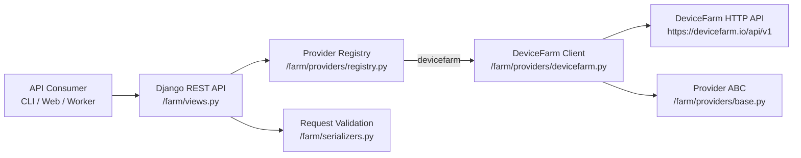

# napolean

A basic Django service for managing a mobile phone farm through a unified API and pluggable provider clients (starting with DeviceFarm).

## What this project does

- Exposes REST endpoints for phone lifecycle and automation actions
- Uses a provider abstraction so multiple hardware platforms can be supported
- Includes a DeviceFarm client implementation

## Tech stack

- Python
- Django
- Django REST Framework
- requests

## Quick start

```bash
python -m pip install -r requirements.txt
python manage.py migrate
python manage.py runserver
```

## Configuration

Set provider credentials as environment variables:

- `DEVICEFARM_API_KEY`: API key for `https://devicefarm.io/api/v1`

## API overview

Base path: `/api/`

- `GET /api/providers/`
- `GET /api/providers/{provider}/phones`
- `POST /api/providers/{provider}/phones`
- `POST /api/providers/{provider}/phones/{phone_id}/start`
- `POST /api/providers/{provider}/phones/{phone_id}/stop`
- `POST /api/providers/{provider}/phones/{phone_id}/prepare`
- `POST /api/providers/{provider}/phones/{phone_id}/shell`
- `POST /api/providers/{provider}/phones/{phone_id}/script`
- `GET /api/providers/{provider}/phones/{phone_id}/script?run_id=...`
- `DELETE /api/providers/{provider}/phones/{phone_id}`

## Architecture diagram


